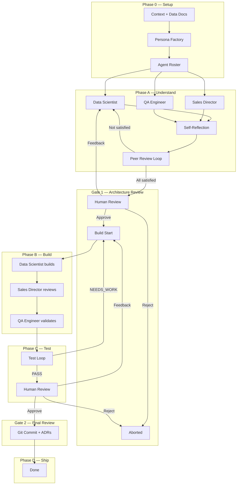

# Agentic Data Science Pipeline

A **LangGraph-based multi-agent system** where AI agents with different expert perspectives collaborate to design, build, test, and ship data science solutions — with human review gates at critical checkpoints.

## Architecture



## Quick Start

### 1. Clone and install

```bash
git clone <repo-url> && cd agentic-data-science
python -m venv .venv && source .venv/bin/activate
pip install -r requirements.txt
```

### 2. Set API keys

```bash
cp .env.example .env
# Edit .env with your actual keys
```

### 3. Run with sample inputs

```bash
python run.py \
    --context inputs/sample/context.md \
    --data-sources inputs/sample/data_sources.md \
    --quality balanced
```

### 4. Run with your own project

```bash
# Copy and fill in the templates
cp inputs/context_template.md my_project/context.md
cp inputs/data_sources_template.md my_project/data_sources.md

# Edit both files with your business context

python run.py \
    --context my_project/context.md \
    --data-sources my_project/data_sources.md \
    --quality maximum \
    --samples-dir my_project/data/
```

## CLI Reference

| Argument | Required | Description |
|---|---|---|
| `--context` | Yes | Path to business context `.md` file |
| `--data-sources` | Yes | Path to data sources documentation `.md` file |
| `--quality` | No | Preset: `fast`, `balanced` (default), `maximum` |
| `--samples-dir` | No | Directory with sample data files for profiling |
| `--config` | No | Path to config YAML (default: `config.yaml`) |
| `--verbose` | No | Enable DEBUG-level logging |

## Configuration

Edit `config.yaml` to customise the pipeline. Key settings:

### Quality Presets

| Preset | Models | Loops | Reflection | Best Practice Checks |
|---|---|---|---|---|
| `fast` | gpt-5.4-mini | 2 | Off | Never |
| `balanced` | claude-sonnet-4-6 / gpt-5.4 | 5 | On | On uncertainty |
| `maximum` | claude-opus-4-6 / gpt-5.4 | 10 | On | Always |

### Per-Role Model Selection

Each agent role can use a different model. Configure under `quality_presets.<preset>.model_config`:

```yaml
model_config:
  data_scientist:
    model: claude-sonnet-4-6
    temperature: 0.4
    max_tokens: 8192
  sales_director:
    model: gpt-5.4
    temperature: 0.6
    max_tokens: 4096
  qa_engineer:
    model: claude-sonnet-4-6
    temperature: 0.1
    max_tokens: 8192
```

## How to Add a New Persona

1. **Create the persona file** in `agents/personas/`:

```python
# agents/personas/my_expert.py
from agents.personas.base import BasePersona, PersonaConfig

class MyExpertPersona(BasePersona):
    @property
    def system_prompt(self) -> str:
        return "You are an expert in ..."
```

2. **Register it** in `agents/personas/__init__.py`:

```python
from agents.personas.my_expert import MyExpertPersona

PERSONA_REGISTRY["my_expert"] = MyExpertPersona
```

3. **Add model config** to each preset in `config.yaml`:

```yaml
my_expert:
  model: claude-sonnet-4-6
  temperature: 0.3
  max_tokens: 8192
```

4. **Add to default roster** (optional) in `config.yaml` under `persona_factory.default_personas`.

The Persona Factory can also dynamically add your persona when it detects relevant domain context.

## Feedback Loops and ADR System

### Human Review Gates

The pipeline pauses at two gates:

- **Gate 1 (Architecture Review)** — After Phase A, before any code is written. You review the proposed approach, assumptions, and data dictionary.
- **Gate 2 (Final Review)** — After Phase C, before shipping. You review the built pipeline, test results, and final outputs.

At each gate you can:
- **Approve** (`y`) — proceed to the next phase
- **Reject** (`n`) — abort the pipeline
- **Provide feedback** (`f`) — agents revise and re-submit

### Architecture Decision Records

Every significant decision is logged as an ADR in the `decisions/` directory. ADRs capture:
- What was decided and why
- What alternatives were considered
- Stakeholder feedback that influenced the decision

See `decisions/template.md` for the format.

## Project Structure

```
agentic-data-science/
├── run.py                         # CLI entry point
├── config.yaml                    # Quality settings, model choices
├── agents/
│   ├── persona_factory.py         # Dynamically selects agents
│   ├── swarm.py                   # LangGraph state machine
│   └── personas/
│       ├── base.py                # Base agent class
│       ├── data_scientist.py      # Senior Data Scientist
│       ├── sales_director.py      # Sales Director
│       └── qa_engineer.py         # QA Engineer
├── tools/
│   ├── best_practice.py           # Industry best practice search
│   ├── code_generator.py          # Python file generator
│   ├── diagram_generator.py       # Mermaid diagram generator
│   └── data_profiler.py           # Data quality profiler
├── gates/
│   └── review.py                  # Human review checkpoints
├── inputs/                        # Templates and sample inputs
├── outputs/                       # Generated artefacts
├── pipeline/                      # Generated pipeline code
└── decisions/                     # Architecture Decision Records
```

## License

Private — all rights reserved.
