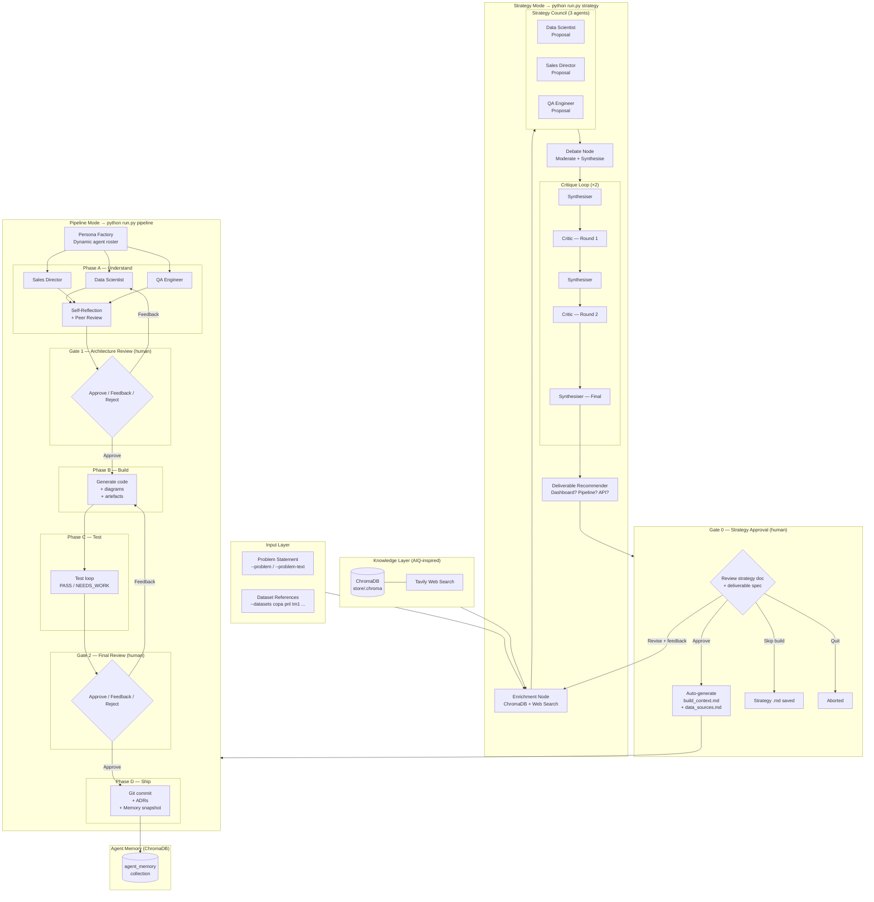

# Agentic Data Science Pipeline

A **LangGraph-based multi-agent system** inspired by the [NVIDIA AI-Q Blueprint](https://github.com/NVIDIA-AI-Blueprints/aiq), combining a ChromaDB knowledge layer, Tavily web search, a multi-agent strategy council with iterative self-critique, and a gated build pipeline — all runnable from a single CLI entry point.

---

## Architecture

### Full System Overview



### AIQ Concept Mapping

| NVIDIA AI-Q Concept | This Implementation | File |
|---|---|---|
| Knowledge Layer API | ChromaDB `PersistentClient` | `store/client.py` |
| NeMo Retriever | `retrieve_for_query()` | `store/retriever.py` |
| Web Search Tool | Tavily `@tool` + direct API | `tools/web_search.py` |
| Orchestration Node | Intent + depth classifier | `orchestration/nodes.py` |
| Shallow Research Agent | Single-pass retrieval + citations | `orchestration/nodes.py` |
| Deep Research Agent | Planner → researcher loop → synthesiser | `orchestration/graph.py` |
| Meta / Clarifier Agent | `meta_node` | `orchestration/nodes.py` |
| YAML Workflow Config | `config.yaml` quality presets | `config.yaml` |
| Eval Harnesses | `example_usage.py` | `example_usage.py` |

---

## Quick Start

### 1. Clone and install

```bash
git clone https://github.com/klexoskai/agentic-data-science.git
cd agentic-data-science
python -m venv .venv && source .venv/bin/activate
pip install -r requirements.txt
```

### 2. Set API keys

```bash
cp .env.example .env
```

```env
OPENAI_API_KEY=sk-...
TAVILY_API_KEY=tvly-...      # free tier at tavily.com — 1000 searches/mo
                              # omit and use --no-web-search if not set
```

### 3. Ingest your data into ChromaDB (once)

```bash
python -m store.ingest          # ingests all CSVs + markdown docs
python -m store.ingest --reset  # wipe + re-ingest (after updating data files)
```

### 4. Run the Strategy Council

```bash
# Reference context.md as the problem, name datasets by short key
python run.py strategy \
  --problem inputs/sample/context.md \
  --datasets copa pnl launch_tracker tm1 iqvia \
  --quality balanced --verbose

# Or pass the problem inline
python run.py strategy \
  --problem-text "Design a 12-month SKU launch forecast pipeline for SEA OTC markets." \
  --datasets copa pnl tm1 \
  --quality fast --no-web-search
```

**What happens:**
1. Agents fetch ChromaDB + web context, then each independently draft a strategy
2. A moderator debates and synthesises the three proposals
3. A critic stress-tests the strategy twice, agents revise each round
4. A Deliverable Recommender reads the final strategy and suggests the best end product (dashboard / pipeline / API / report)
5. **Gate 0** shows you the strategy doc + deliverable spec — you approve, request a revision with feedback, skip the build, or quit
6. On approval, the pipeline build phase launches automatically with auto-generated context files

### 5. Run the Pipeline directly

```bash
python run.py pipeline \
  --context inputs/sample/context.md \
  --data-sources inputs/sample/data_sources.md \
  --quality balanced \
  --launch-frontend
```

---

## CLI Reference

### Shared flags (all modes)

| Flag | Default | Description |
|---|---|---|
| `--quality` | `balanced` | Quality preset: `fast`, `balanced`, `maximum` |
| `--config` | `config.yaml` | Path to YAML config file |
| `--verbose` | off | Enable DEBUG-level logging |

### `strategy` mode

| Flag | Required | Description |
|---|---|---|
| `--problem FILE` | one of these | Path to business problem `.md` file |
| `--problem-text TEXT` | one of these | Inline problem statement string |
| `--datasets NAME...` | Yes | Short dataset names (see table below) |
| `--output FILE` | No | Custom output path for strategy `.md` |
| `--no-web-search` | No | Disable Tavily (if `TAVILY_API_KEY` not set) |

**Dataset short names:**

| Short name | File |
|---|---|
| `copa` | `copa.csv` |
| `pnl` | `pnl2425_volume_extracts_matched.csv` |
| `launch_tracker` | `launch_tracker25_matched.csv` |
| `tm1` | `tm1_qty_sales_pivot.csv` |
| `iqvia` | `IQVIA_Asia_data1.csv` |
| `euromonitor` | `euro_mon_hier1_RSP_USD_histconst2024_histfixedER20242.csv` |
| `nicholas_hall` | `Nicholas_Hall.csv` |
| `who_flu` | `WHO_FLU.csv` |
| `forecast` | `data/raw/forecast.csv` |

### `pipeline` mode

| Flag | Required | Description |
|---|---|---|
| `--context FILE` | Yes | Path to business context `.md` |
| `--data-sources FILE` | Yes | Path to data sources documentation `.md` |
| `--samples-dir DIR` | No | Directory with sample data files for profiling |
| `--launch-frontend` | No | Start Dash app on localhost after completion |

---

## Quality Presets

### Pipeline mode

| Preset | Models | Review loops | Reflection | Best practice checks |
|---|---|---|---|---|
| `fast` | gpt-5.4-mini | 2 | Off | Never |
| `balanced` | claude-sonnet-4-6 / gpt-5.4 | 5 | On | On uncertainty |
| `maximum` | claude-opus-4-6 / gpt-5.4 | 10 | On | Always |

### Strategy mode

| Preset | Council model | Critic model | Web search depth | ChromaDB results |
|---|---|---|---|---|
| `fast` | gpt-4o-mini | gpt-4o-mini | basic | 5 |
| `balanced` | gpt-4o | gpt-4o | advanced | 8 |
| `maximum` | gpt-4o | gpt-4o | advanced | 12 |

---

## Context Store (ChromaDB)

Three collections, all under `store/.chroma/` (gitignored):

| Collection | Contents | Ingested from |
|---|---|---|
| `data_sources` | CSV rows chunked by SKU / row batch | All files in `data/` |
| `context_docs` | Markdown sections | `inputs/`, `decisions/`, `README.md` |
| `agent_memory` | Past pipeline run snapshots | Written automatically after each `pipeline` run |

```bash
# Ingest / update
python -m store.ingest                  # all sources
python -m store.ingest --source csv     # CSVs only
python -m store.ingest --source docs    # markdown docs only
python -m store.ingest --reset          # wipe + re-ingest

# Inspect
python peek_store.py
```

---

## Tooling

| Tool | Purpose | Config |
|---|---|---|
| **LangGraph** | State machine / graph orchestration | `agents/swarm.py`, `orchestration/` |
| **LangChain** | LLM wrappers, `@tool` decorators | Throughout |
| **OpenAI API** | LLM inference (all agents) | `OPENAI_API_KEY` in `.env` |
| **ChromaDB** | Local vector store (knowledge layer) | `store/`, persists to `store/.chroma/` |
| **sentence-transformers** | Local embeddings (`all-MiniLM-L6-v2`) | `store/config.py` |
| **Tavily** | Web search tool | `tools/web_search.py`, `TAVILY_API_KEY` |
| **Plotly Dash** | Frontend (pipeline build output) | `pipeline/` |
| **Rich** | Terminal UI, panels, progress | `run.py` |
| **Pydantic v2** | State models | `orchestration/strategy_state.py` etc. |

---

## Project Structure

```
agentic-data-science/
│
├── run.py                              # CLI entry point (pipeline | strategy)
├── config.yaml                         # Quality presets for both modes
├── requirements.txt
│
├── agents/                             # Pipeline mode agents
│   ├── persona_factory.py              # Dynamic agent roster selection
│   ├── swarm.py                        # LangGraph state machine (Phase A→D)
│   └── personas/
│       ├── base.py
│       ├── data_scientist.py
│       ├── sales_director.py
│       └── qa_engineer.py
│
├── orchestration/                      # Strategy mode + AIQ research graph
│   ├── state.py                        # ResearchState (AIQ shallow/deep)
│   ├── nodes.py                        # AIQ orchestrator, shallow, deep, meta nodes
│   ├── graph.py                        # AIQ research graph + run_research()
│   ├── strategy_state.py               # StrategyState + CouncilMember
│   ├── strategy_nodes.py               # Enrichment, council, debate, critic, synthesiser
│   ├── strategy_council.py             # Strategy Council graph + run_strategy_council()
│   └── deliverable_recommender.py      # Recommends end product from strategy doc
│
├── store/                              # ChromaDB knowledge layer
│   ├── config.py                       # Paths, collection names, embedding config
│   ├── client.py                       # Singleton PersistentClient
│   ├── ingest.py                       # CSV + markdown ingestion pipeline
│   ├── retriever.py                    # Query interface for all agents
│   ├── memory.py                       # Saves run snapshots to agent_memory
│   └── .chroma/                        # On-disk ChromaDB data (gitignored)
│
├── tools/
│   ├── web_search.py                   # Tavily web search + chroma_search @tools
│   ├── best_practice.py
│   ├── code_generator.py
│   ├── diagram_generator.py
│   └── data_profiler.py
│
├── gates/
│   ├── review.py                       # Gate 1 + Gate 2 (pipeline mode)
│   └── strategy_gate.py                # Gate 0 (strategy approval + deliverable review)
│
├── integration/
│   └── pipeline_bridge.py              # Wires research graph into SwarmState
│
├── inputs/
│   ├── sample/context.md
│   ├── sample/data_sources.md
│   └── strategy/                       # Auto-generated build context files
│
├── data/                               # Raw data files
├── outputs/
│   └── strategy/                       # Strategy docs + deliverable specs
├── pipeline/                           # Generated pipeline code
└── decisions/                          # Architecture Decision Records (ADRs)
```

---

## Human Review Gates

| Gate | Mode | When | Options |
|---|---|---|---|
| **Gate 0** | strategy | After strategy doc + deliverable spec generated | Approve → build / Revise with feedback / Skip build / Quit |
| **Gate 1** | pipeline | After Phase A (architecture), before build | Approve / Feedback (revise) / Reject |
| **Gate 2** | pipeline | After Phase C (test), before ship | Approve / Feedback (revise) / Reject |

---

## License

Private — all rights reserved.
